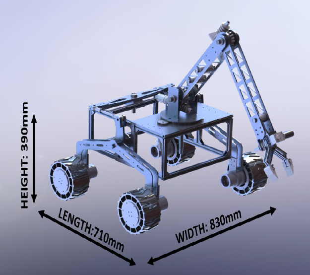

# IROC-U: ISRO Robotics Challenge Mars Rover Prototype

> **Design and Test Report** for Team Vishwa (Veermata Jijabai Technological Institute - VJTI, Mumbai). Developed for the ISRO Robotics Challenge (IROC-U) organized by URSC, featuring complete mobility mechanics, structural FEA validations, custom electronics, and ROS autonomous navigation architectures.

---

## Project Overview
Team Vishwa engineered a high-performance space robotics prototype designed to negotiate challenging off-road terrain, lift heavy payloads via a 3-DOF manipulator, and execute autonomous mapping. This repository documents the mechanical, electrical, and software design workflows.

* **Team Member / Contributor:** Mohammed Wafeeq Kazi
* **Institution:** Veermata Jijabai Technological Institute (VJTI), Mumbai
* **Competition:** ISRO Robotics Challenge - URSC (IROC-U)

---

## Rover Specifications & Dimensions
* **Length:** 710 mm
* **Width:** 830 mm
* **Height:** 390 mm
* **Chassis Construction:** Box frame structure built using Aluminium 6063-T6 extruded bars (20x20 mm) interconnected via T-slot sliding nuts and corner brackets, sheathed with aluminum and acrylic sheets for optimal load handling and weight reduction.
* **Mobility & Suspension:** Inverted-V suspension mechanism featuring differential linkages to ensure continuous all-wheel ground contact across uneven terrain, driven by high-torque planetary DC motors (140 kgf-cm) paired with custom 3D-printed TPU wheels and bearing-housed hubs.

---

## Key Subsystem Architecture

### 1. Drive & Manipulator Electronics
* **Microcontrollers:** Centralized processing handled by Arduino Mega microcontrollers interacting with an onboard NVIDIA Jetson Nano.
* **Closed-Loop Control:** Custom BTS7960 motor driver boards coupled with OE-37 and AS5600 magnetic rotary encoders executing precise PID-tuned speed and position tracking.
* **Power Distribution:** Centralized system powered by three parallel LiFePO4 batteries (12V, 30Ah total capacity) featuring an integrated emergency kill switch for immediate safety shutdowns.

### 2. Manipulator & Arm Mechanics
* **Kinematics:** 3-DOF articulated robotic arm designed to lift a target payload of 5 kg (tested structurally up to 8-9 kg limits).
* **Gear Reductions:** Incorporates planetary gear motors combined with a 15:1 ratio worm gear (bronze wheel and steel worm) to maximize joint torque while minimizing backlash at the shoulder and elbow joints.

### 3. Robotics & Software Architecture
* **ROS Framework:** Built on ROS Melodic running on the Jetson Nano, orchestrating modular nodes for sensor drivers, motor control, and trajectory planning.
* **Autonomous Navigation:** Implements Adaptive Monte Carlo Localization (AMCL) and the ROS navigation stack utilizing depth camera inputs and A* search algorithms for obstacle avoidance and path planning.
* **Communication Systems:** Point-to-point (P2P) and point-to-multipoint (PtMP) wireless transmission utilizing Ubiquiti Rocket M5 radios operating across the 5 GHz band with high-gain omnidirectional and sector antennas.

---

## Structural Analysis & FEA Validation
Finite Element Analysis and static load calculations were conducted to validate structural integrity under extreme operational stresses:
* **Suspension Flange:** Evaluated under a 400 N load case.
* **Manipulator Base:** Validated against torsional loads of 100,000 N-mm.
* **Extruded Frame:** Tested under bending moments of 50,000 N-mm across central spans, ensuring safety factors well above operational requirements.

---

## Documentation
* **[Download Complete Design and Test Report (PDF)](./IROC_2024___Design_and_Testing_Report.pdf)**: Access the official design report detailing exact COTS component specifications, circuit schematics, bill of materials, and FEA stress contour plots.
